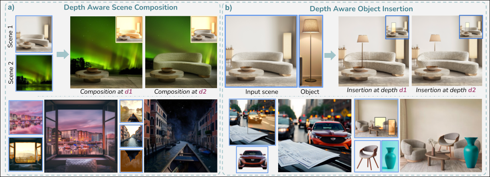
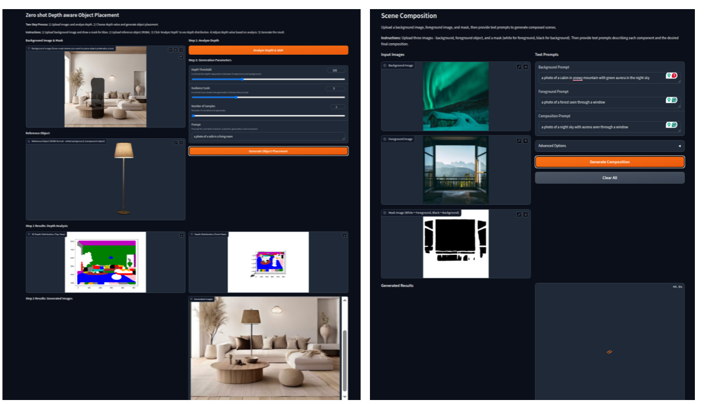

<p align="center">

  <h2 align="center">Zero shot Depth aware editing using Diffusion models</h2>
  <h2 align="center">[ICCV 2025]</h2>
  <p align="center">
    <a href="https://rishubhpar.github.io/"><strong>Rishubh Parihar</strong></a>
    ·
    <a href="https://scholar.google.com/citations?user=Hup_9BkAAAAJ&hl=en"><strong>Sachidanand VS</strong></a>
    ·
    <a href="https://cds.iisc.ac.in/faculty/venky/"><strong>Venkatesh Babu R</strong></a>
    <br>
    <br>
        <a href="https://rishubhpar.github.io/DAEdit/pdf/main_paper.pdf"></a>
        <a href='https://rishubhpar.github.io/DAEdit/'></a>
    <br>
    <b>Indian Institute of Science</b>
  </p>
  
  <table align="center">
    <tr>
    <td>
      
    </td>
    </tr>
  </table>

## News
* **[2025.07.15]** Release inference & Gradio demo code for depth aware object placement and scene composition tasks.
* **[Soon]** Release the benchmarking dataset for both tasks.


## Installation
Install with `conda`: 
```bash
conda env create -f environment.yml
```

## Download Checkpoints
For object placement we use AnyDoor for inpainting, download the weights from: 
* [ModelScope](https://modelscope.cn/models/damo/AnyDoor/files)
* [HuggingFace]( https://huggingface.co/spaces/xichenhku/AnyDoor/tree/main)

**Note:** They include all the optimizer params for Adam, so the checkpoint is big. You could only keep the "state_dict" to make it much smaller.

Download DINOv2 checkpoint and revise `/configs/anydoor.yaml` for the path (line 83)
* URL: https://github.com/facebookresearch/dinov2?tab=readme-ov-file

Or to simply download all the weights, run the `download_weights.sh` script:
```
mkdir weights
bash download_weights.sh
```

## Inference
We provide inference code for both depth aware object placement and scene composition. You should place the images in respective folder under `examples/gradio` and modify the image path and run the following code, some sample input images are given in `examples` folder. The generated results are provided in `results/object_placement` for object placement image, and `results/scene_comp` for scene composition.

```bash
# for Depth aware object placement
python run_inference_object_placement.py

# for Depth aware Scene composition
python inference_scene_composition.py
```

## Docker
We provide a Docker Compose setup that builds the Conda environment from `environment.yml`, mounts your local repository, and caches large Torch Hub downloads.

`docker/` contents:
- `Dockerfile` builds the Micromamba-based image and reproduces the `depthedit` environment.
- `docker-compose.yaml` defines the `dar` service, mounts the repo and `.docker_cache`, and exposes port `7860`.
- `run_gradio.sh` chooses which Gradio script to launch via `GRADIO_DEMO`.

Build the image (rerun if dependencies or the Dockerfile change):
```bash
docker compose -f docker/docker-compose.yaml build
```

### Interactive Shell
Drop into a container shell (repo mounted at `/workspace`):
```bash
docker compose -f docker/docker-compose.yaml run --rm dar bash
```
From there you can run scripts such as `bash download_weights.sh` or launch the demos manually.

### Gradio Demo via Docker Compose
Start the default Gradio UI (scene composition) on <http://localhost:7860>:
```bash
docker compose -f docker/docker-compose.yaml up
```
Switch to the object placement demo by overriding `GRADIO_DEMO`:
```bash
GRADIO_DEMO=object_placement docker compose -f docker/docker-compose.yaml up
```
Model caches persist under `.docker_cache/` (create it once with `mkdir -p .docker_cache`) so large downloads happen only once.

## Gradio demo 
Currently, we suport local gradio demo for both object placement and scene composition inference. To launch it run the correspondint scripts: 

### 1. Object Placement Demo (`gradio_demo_op.py`)

This demo allows you to place objects into scenes with depth-aware positioning.

**Running the Demo:**
```bash
python gradio_demo_op.py
```

**Usage Instructions:**
1. Upload a background image and draw a mask where you want to place the object preferably a bounding box.
2. Upload a reference object image (RGBA with transparency)
3. The system will plot a coloured point cloud of the scene in front view and top view.
4. Adjust the depth value as per where you want to place an object in the scene based on the top view plot.
5. The generated image will show the object placed at the specified depth

### 2. Scene Composition Demo (`gradio_demo_sc.py`)

This demo enables depth-aware scene composition by combining multiple elements.

**Running the Demo:**
```bash
python gradio_demo_sc.py
```

**Usage Instructions:**
1. Upload a background image
2. Upload a foreground object image
3. Upload a mask image (white for foreground, black for background)
4. Provide text prompts describing:
   - Background scene
   - Foreground object
   - Desired final composition
5. Generate the composed scene

The gradio demo would look like the UI shown below:
<!-- 
* 📢 This version requires users to annotate the mask of the target object, too coarse mask would influence the generation quality. We plan to add mask refine module or interactive segmentation modules in the demo. -->

<table align="center">
  <tr>
  <td>
    
  </td>
  </tr>
</table>


## Acknowledgements
This project is developed on the codebase of [Anydoor](https://github.com/ali-vilab/AnyDoor) and [DiffusionHandles](https://github.com/adobe-research/DiffusionHandles). We appreciate these great work! 


## Citation
If you find this codebase useful for your research, please use the following entry.
```BibTeX
@inproceedings{rishubh2025zeroshot,
      title = {Zero-Shot Depth-Aware Image Editing with Diffusion Models},
      author = {Rishubh Parihar, Sachidanand VS, R. Venkatesh Babu},
      booktitle = {International Conference on Computer Vision (ICCV)},      
      year = {2025},
}
```
